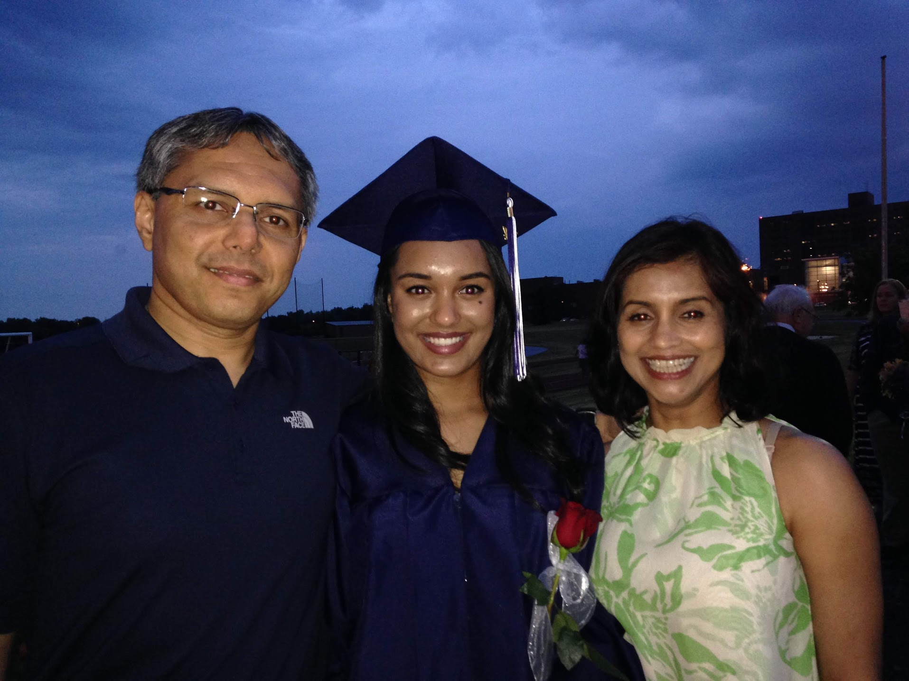
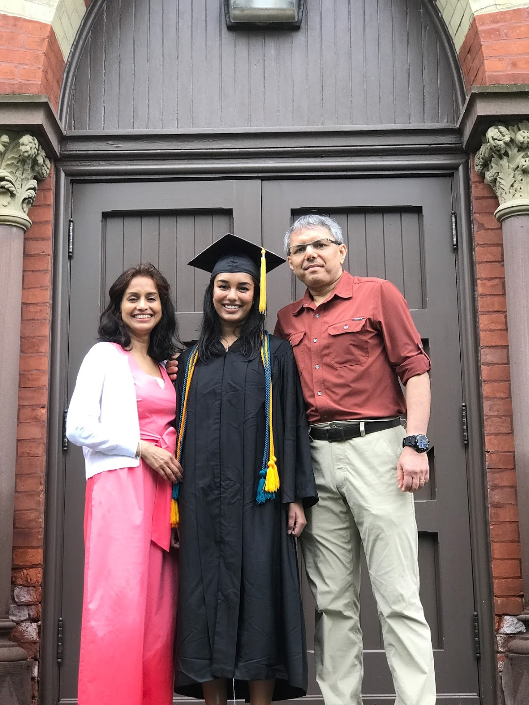
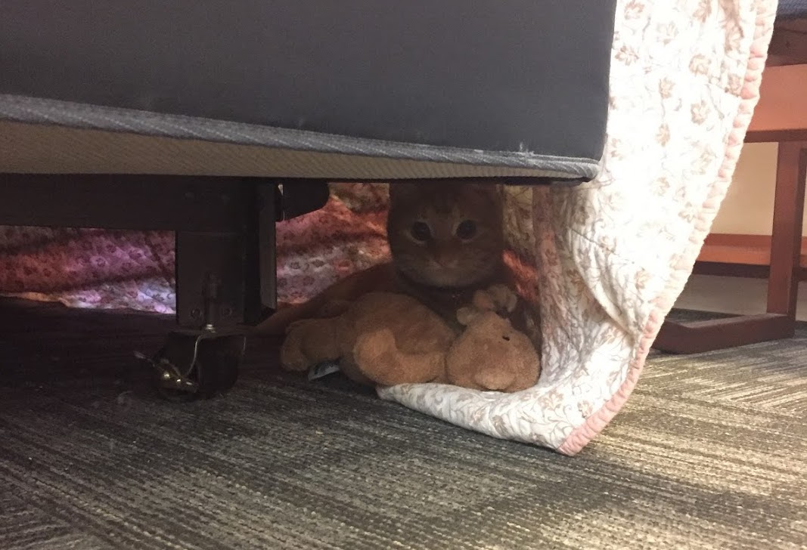
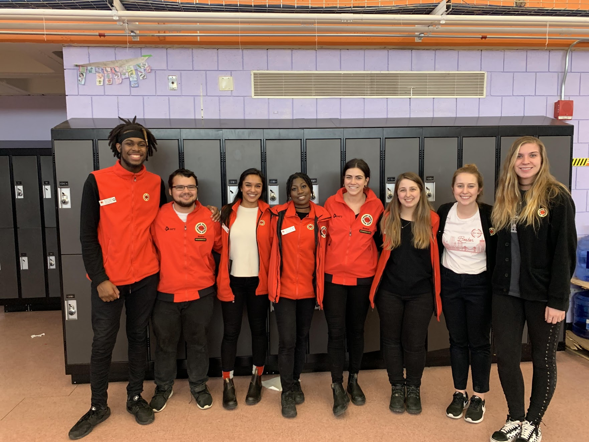
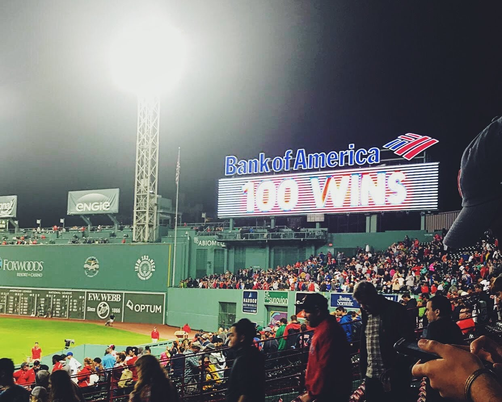

# Early Life

I was born in Logan, UT and moved to Brighton, NY in 2000 when I was four years old. I attended Brighton Central School District schools from kindergarten through senior year of high school and graduated from Brighton High School in 2014. While there, I was on the swim team, actively involved in Model UN, and was also part of the women's choir.

This is a picture of me with my parents at my high school graduation.

# Collegiate Life

## Academic Life

In the fall of 2014, I started college at Cornell University located in Ithaca, NY. I was in the College of Agriculture and Life Sciences and entered as a Communications major who was also on a pre-med track. 

After a bit of self discovery, I decided that I wanted to switch to being a Development Sociology major instead. Development Sociology is a relatively obscure major and is predominantly a sociology major with a focus in global development. One of my favorite classes in this major was that about demographics. 

I also completed all of my pre-medical coursework and also was a Law & Society minor. This minor was really unique in the sense that I was able to take classes meant for undergraduates at the law school taught by law professors. These were some of my most memorable classes and have had a lasting impact on me. 

In my senior year, I decided to write an Honors Thesis in the Social Sciences. I decided to write my thesis about decision making under uncertainty in the area of antibiotic resistance. I successfully defended my thesis and then ended up publishing my thesis in two parts. If you would like to read them, here are the links below:

[The Physician's Perspective](https://file.scirp.org/Html/29-1501602_86700.htm)

[The Patient's Perspective](https://www.sciencedirect.com/science/article/abs/pii/S1059056018304982?via%3Dihub)

I graduated from Cornell University in May 2018! Below is a picture of me at my college graduation (it rained for the entire ceremony, so everyone was very damp):

## Outside of School

During my freshman and sophmore years, I worked as a lab assistant at a lab at Cornell University that was led by Dr. John Lis. This was an informative experience that taught me a lot about how research labs work.

During the summer of 2016, I moved to Atlanta, GA for an internship at the Centers for Disease Control. I had never before lived in the South and this was a new experience for me in many different ways. While there, I worked under Dr. Alexander Rowe and Dr. Samantha Rowe on a meta-analysis that focused on health care worker performance in low and middle income countries (LMICs). This was a huge project that was the first of its kind and was funded in part by the Bill and Melinda Gates Foundation.

The following year, I returned to the CDC to work in an entirely different environment -- a lab. I had the experience of working with stool samples (interesting, to say the least) to try to find cyclospora oocytes (or in plain English: the eggs of a parasite that causes diarreha). This was a parasitic disease that was not well understood and the lab was trying to increase academic understanding of it.

(I had the pleasure of living with this kitten named Buffalo Chicken Dip during my first summer in Atlanta!)

During college, I also was relativley politically active and volunteered a lot for the campaigns of Hillary Clinton and Bernie Sanders. I helped to organize phone banking events as well as in person canvassing events. 

# Gap Year: Boston

After always dreaming of moving to Boston, I had the opportunity to live and work there for one year through an AmeriCorps program called City Year. For those unfamiliar with this program, we are essentially teacher's assistants. For my year, I worked as a City Year in a 6th, 7th, and 8th grade science classroom where I helped teach nearly 100 students. I also helped tutor 4th grade students in an afterschool program that was run by the Boy's and Girl's Club of Boston. When I was not in the school, I also helped to work for Recruitment and Admissions at City Year Boston (also known as RAD Squad). 

(All of the City Year Corps Members who worked at my school!)

In my free time, I loved exploring the city and going to Red Sox games at Fenway!

# Graduate School

## Academic Life

During my senior year of college and my gap year, I decided I wanted to pursue an MPH degree; this was influenced by my summers at the CDC. While in Boston, I applied to a number of programs and ended up selecting my top choice school at Columbia University's Mailman School of Public Health and I moved to NYC in September 2019. 

While here, I am in the department of Sociomedical Sciences and pursuing a certificate in Applied Biostatistics. I am currenlty in my third semester and will be graduating from this program in the spring of 2021. 

## Outside of School

In my free time, I am on the executive board of SNaHP -- Students for a National Health Program. This organization advocates for a nationalized health care plan in the United States and has chapters across the country; the organization also has an affiliated organization called PNaHP (less snappy of a name, pun intended) which involves physician's in the cause.

I also work part time as a development intern for UNITY Consortium -- a 501(c)3 organization that focuses on adolescent and young adult immunization. This was the role I worked in during my summer practicum and I really enjoy working for this organization. One cool part of my job is that I host a podcast with a fellow intern; give it a listen, link is below!

[FACTSinnated](https://podcasts.apple.com/us/podcast/factsinnated/id1534945694)